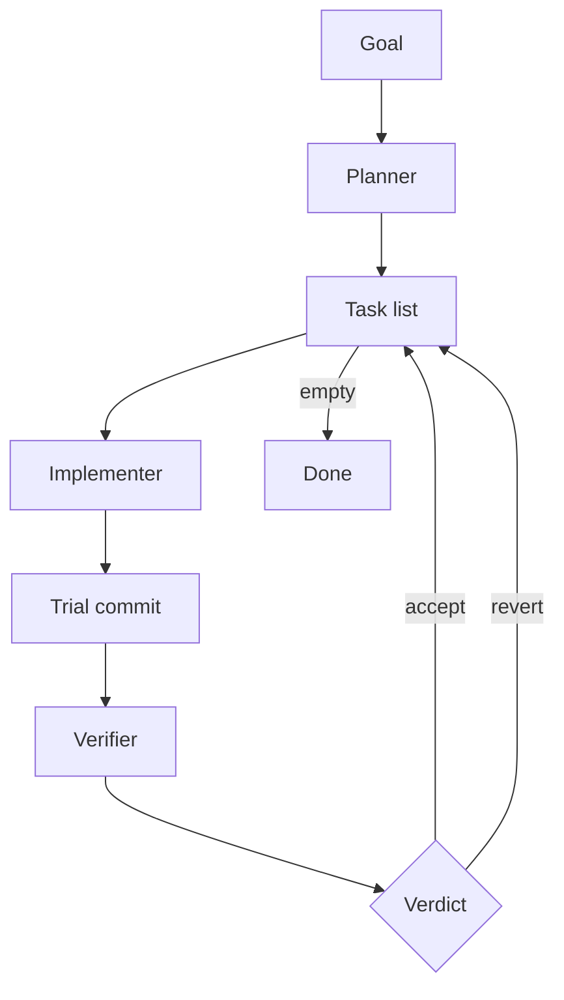

# Harness

`harness` is a Codex skill for long-running coding work.

It splits the job into three roles:

- **planner**: decides what should be built
- **implementer**: writes the code
- **verifier**: checks the exact code change

A small runtime script keeps the loop running in the background.

If you want Codex to work through a project over time instead of trying to do everything in one giant session, this is what `harness` is for.

## Quick Start

Install it as a local Codex skill:

```bash
mkdir -p ~/.codex/skills
ln -sfn /absolute/path/to/harness ~/.codex/skills/harness
```

Then start a fresh Codex session and say what you want:

```text
$harness
Build a Python notes CLI and run it in background mode.
```

From there the planner should:

- scan the repo
- create `plan.md` and `tasks.json`
- decide what task is ready first
- hand tasks to the implementer and verifier until the work is done

## The Loop



That is the whole idea:

- the planner makes the task list
- the implementer does one task
- the verifier checks that exact commit
- the runtime either keeps it or reverts it
- then the loop continues until the work is done

## Why The Roles Are Split

The point of the harness is not complexity for its own sake.

It separates three jobs that are easy to blur together in long runs:

- planning the work
- writing the code
- checking whether the code should stay

That makes background runs easier to inspect and easier to resume.

## What Happens In A Real Run

In a normal run:

1. the planner writes the first plan and task list
2. the implementer works one ready task and creates a trial commit
3. the verifier checks that exact commit
4. the runtime keeps or reverts it
5. the planner continues until the task list is empty

The planner can also expand or reorder the task list if the run discovers new work.

## What It Writes

The harness writes a few files into the repo it is working on:

- `tasks.json`
- `plan.md`
- `harness-state.json`
- `harness-events.tsv`
- `reports/*.json`

These files are how the roles hand work to each other.

In practice:

- `tasks.json` is the task list
- `plan.md` is the human-readable plan
- `harness-state.json` is the current snapshot of the run
- `harness-events.tsv` is the audit log
- `reports/*.json` are the handoff reports from planner, implementer, and verifier

## Background Runs

The harness can run in the background, which means:

- you can start the run and leave
- the runtime keeps launching fresh Codex turns
- you can come back later and inspect what happened

The runtime writes:

- `harness-runtime.json`
- `harness-runtime.log`

Those are the main files to check when a run is still active or if you want to see why it stopped.

## Example

```text
$harness
Build a Python notes CLI and run it in background mode.
```

The expected flow is:

- planner creates the task list
- implementer works one task at a time
- verifier accepts or reverts each commit
- runtime keeps going until the task list is complete

## Tests

```bash
python3 -m unittest discover -s tests -v
```
