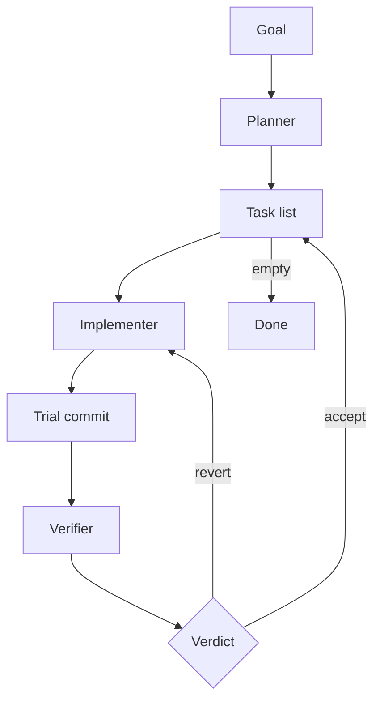

# Harness

`harness` is a Codex skill for long-running coding work.

It splits the job into three roles:

- **planner**: decides what should be built
- **implementer**: writes the code
- **verifier**: checks the exact code change

A small runtime script keeps the loop running in the background, communicating with Codex via the `codex app-server` JSON-RPC protocol.

If you want Codex to work through a project over time instead of trying to do everything in one giant session, this is what `harness` is for.

## Quick Start

Install it as a local Codex skill:

```bash
mkdir -p ~/.codex/skills
ln -sfn /absolute/path/to/harness ~/.codex/skills/harness
```

Then start a fresh Codex session and say what you want:

```text
$harness Build a Python notes CLI
```

The planner will interactively define the goal, scope, and task DAG with you. Once you approve:

```text
$harness run
```

The runtime launches in the background and works through the tasks autonomously.

## Modes

| Command | What it does |
|---|---|
| `$harness <goal>` | Interactive planning — define scope, create task DAG |
| `$harness run` | Launch the background runtime |
| `$harness status` | Check progress |
| `$harness stop` | Stop the runtime |

## The Loop



- The planner creates the task DAG with dependencies and acceptance criteria.
- The implementer works one task and creates a trial commit.
- The verifier evaluates that exact commit against the acceptance criteria.
- The runtime applies the verdict (keep or revert) and moves to the next task.
- If multiple independent tasks are ready, implementers run in parallel.
- If a task is reverted, the implementer retries with the verifier's feedback (resuming the same conversation thread).
- The loop continues until all tasks are done or it reaches `needs_human`.

## How It Works

Each role runs as a separate Codex turn via the `codex app-server` JSON-RPC protocol. Roles get isolated context windows (separate threads) and return structured reports enforced by `outputSchema`.

The runtime is not an LLM — it's a Python script that reads reports, applies state transitions, and decides which role runs next.

### Role Prompts

Each role gets a prompt with its assignment and constraints:

- **Planner**: reads the repo and existing plan, creates/updates `plan.md` and `tasks.json`. Cannot write product code.
- **Implementer**: gets one task with acceptance criteria, makes code changes, creates a single trial commit. Cannot edit `tasks.json`.
- **Verifier**: evaluates the exact trial commit, checks acceptance criteria, runs validation. Returns `accept`, `revert`, or `needs_human`. Cannot modify code.

Reports are returned as structured JSON via `outputSchema` (schemas in `schemas/*.schema.json`), not written to disk by the roles.

### Parallel Execution

When the planner creates multiple tasks with no mutual dependencies, the runtime runs implementers concurrently — one app-server process per task.

### Thread Resume

When the verifier reverts a task and the implementer retries, the runtime resumes the implementer's previous conversation thread. The implementer retains context of what it tried and gets the verifier's feedback prepended to its prompt.

## What It Writes

The harness writes these files into the target repo:

| File | Purpose |
|---|---|
| `tasks.json` | Canonical task DAG |
| `plan.md` | Human-readable plan |
| `harness-state.json` | Current run snapshot (role, task, attempt) |
| `harness-events.tsv` | Append-only audit log |
| `harness-launch.json` | Launch config (goal, scope, policy) |
| `harness-runtime.json` | Runtime status (PID, last decision) |
| `harness-runtime.log` | Stdout/stderr from the background process |
| `harness-servers.json` | App-server PIDs for crash recovery |
| `harness-lessons.md` | Cross-run strategic memory |
| `reports/*.json` | Role handoff reports |

## Tests

```bash
cd /path/to/harness
PYTHONPATH=scripts python3 -m pytest tests/ -v
```

## Development

See [AGENTS.md](AGENTS.md) for internal development documentation, including app-server protocol gotchas, schema requirements, and known limitations.
