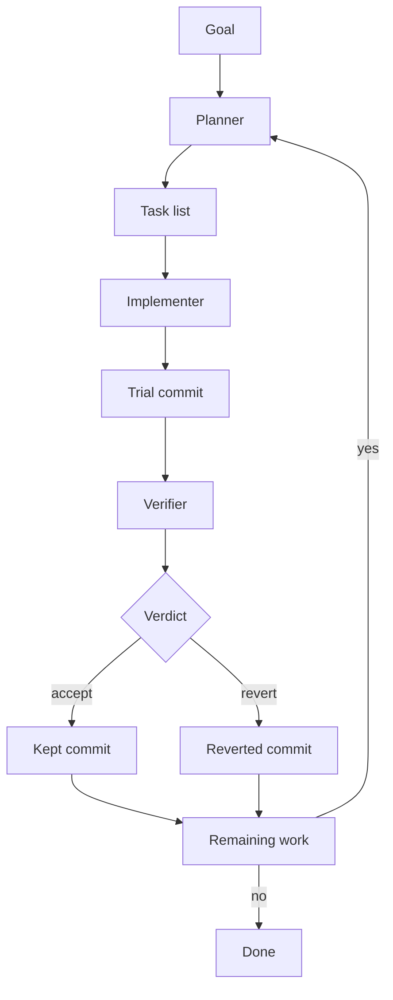

# Harness

`harness` is a Codex skill for long-running coding work.

It splits the job into three roles:

- **planner**: decides what should be built
- **implementer**: writes the code
- **verifier**: checks the exact code change

A small runtime script keeps the loop running in the background.

## The Loop



That is the whole idea:

- the planner makes the task list
- the implementer does one task
- the verifier checks that exact commit
- the runtime either keeps it or reverts it
- then the loop continues until the work is done

## What It Writes

The harness writes a few files into the repo it is working on:

- `tasks.json`
- `plan.md`
- `harness-state.json`
- `harness-events.tsv`
- `reports/*.json`

These files are how the roles hand work to each other.

## Background Runs

The harness can run in the background.

That means you can start a run, close the session, and come back later to check:

- status
- logs
- task list
- reports

## Install

Install it as a local Codex skill:

```bash
mkdir -p ~/.codex/skills
ln -sfn /absolute/path/to/harness ~/.codex/skills/harness
```

Then start a fresh Codex session.

## Example

```text
$harness
Build a Python notes CLI and run it in background mode.
```

## Tests

```bash
python3 -m unittest discover -s tests -v
```
