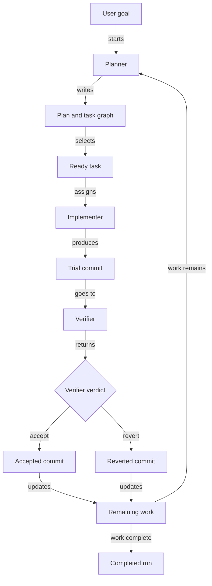
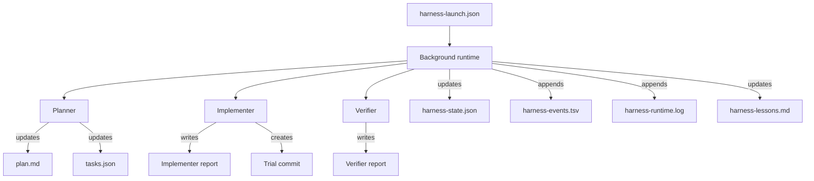

# Harness

`harness` is a Codex skill for long-running coding jobs.

It gives Codex a simple team structure:

- a **planner** decides what work should happen
- an **implementer** writes code for one task at a time
- a **verifier** checks that exact code change
- a **runtime** keeps the whole loop running in the background

If you want Codex to work through a project over time instead of doing everything in one giant session, this is what `harness` is for.

## What It Does

The harness turns a big goal into a repeatable loop:

1. plan the work
2. pick one ready task
3. implement it
4. verify it
5. keep it or revert it
6. continue until the work is done

The important part is that each role has a clear job. Planning, coding, and checking are separate.

## How It Works



In plain English:

- The planner writes the task list.
- The implementer works one task and makes a commit.
- The verifier checks that exact commit.
- The runtime either keeps that commit or reverts it.
- If work remains, the planner updates the task graph and the loop continues.

## Why This Exists

A normal coding session can get messy when it runs for a long time:

- planning and coding blur together
- it becomes hard to resume after interruptions
- there is no clean audit trail
- background execution is awkward

The harness solves that by keeping:

- clear roles
- a task graph
- durable run state
- a background runtime
- logs and reports you can inspect later

## Background Runtime

The runtime is not another coding agent. It is a control script.

Its job is to:

- start a run
- keep it going in the background
- launch fresh Codex turns
- apply verifier decisions
- write state files and logs
- let you check status or stop the run later



## Files It Writes

The harness writes these files into the repo it is working on:

- `harness-launch.json`
- `harness-runtime.json`
- `harness-runtime.log`
- `harness-state.json`
- `harness-events.tsv`
- `harness-lessons.md`
- `tasks.json`
- `plan.md`
- `reports/*.json`

These files are how the roles communicate with each other.

The most important ones are:

- `tasks.json`
  - the task list and dependencies
- `plan.md`
  - the human-readable plan
- `harness-state.json`
  - the current run snapshot
- `harness-events.tsv`
  - the audit log of what happened
- `reports/*.json`
  - planner, implementer, and verifier handoff reports

## Run Modes

- `foreground`
  - keep the work in the current Codex session
- `background`
  - run detached in the background
- `status`
  - inspect a background run
- `stop`
  - stop a background run

## Install

Install it as a local Codex skill by symlinking the repo:

```bash
mkdir -p ~/.codex/skills
ln -sfn /absolute/path/to/harness ~/.codex/skills/harness
```

Then start a fresh Codex session so the skill is loaded.

## Example

```text
$harness
Build a Python notes CLI backed by a local JSON file. Use a planner/implementer/verifier flow and run it in background mode.
```

What should happen:

- the planner creates `plan.md` and `tasks.json`
- the implementer works one task at a time
- the verifier accepts or reverts each task commit
- the runtime keeps going until the task graph is complete

## What This Project Is Trying To Be

This project is intentionally narrow.

It is meant to be:

- reliable
- resumable
- easy to inspect
- easy to run in the background

It is not trying to be:

- a giant swarm framework
- a live multi-agent chat system
- a multi-repo orchestration platform

The goal is simple: make long-running Codex work understandable and controllable.

## Tests

Run the harness test suite with:

```bash
python3 -m unittest discover -s tests -v
```
