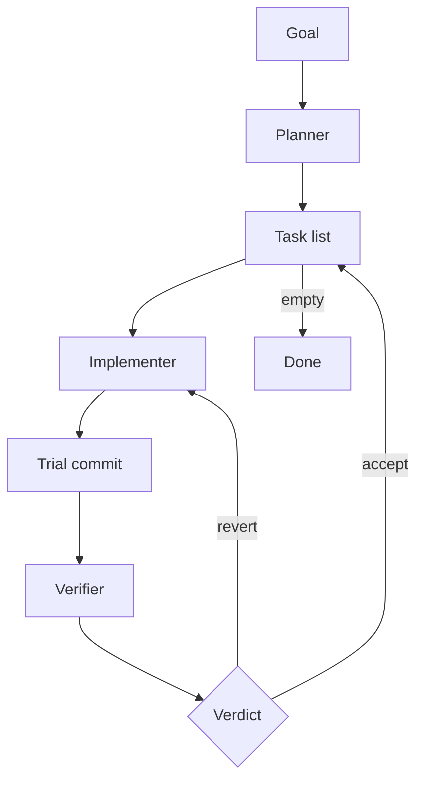

# Harness

A Codex skill for long-running coding work. Instead of one giant session, it splits the job into a planner → implementer → verifier loop and runs it in the background via the `codex app-server` JSON-RPC protocol.

## Warning

By default, the harness runs all roles with `danger-full-access` sandbox mode, which disables Codex's sandbox entirely. This gives the agents full access to your filesystem and network. Only run the harness on repos and machines where you're comfortable with that.

To use a restricted sandbox, set `execution_policy: workspace_write` in the launch config.

## Quick Start

Install it as a local Codex skill:

```bash
mkdir -p ~/.agents/skills
ln -sfn /absolute/path/to/harness ~/.agents/skills/harness
```

Then start a fresh Codex session and say what you want:

```text
$harness Build a Python notes CLI
```

The planner will interactively define the goal, scope, and task DAG with you. Once you approve:

```text
$harness run
```

The runtime launches in the background and works through the tasks autonomously.

## Modes

| Command | What it does |
|---|---|
| `$harness <goal>` | Interactive planning — define scope, create task DAG |
| `$harness run` | Launch the background runtime |
| `$harness status` | Check progress |
| `$harness stop` | Stop the runtime |

## The Loop



Each role runs as a separate Codex turn with an isolated context window and returns a structured report via `outputSchema` (schemas in `schemas/*.schema.json`).

| Role | Job | Constraints |
|---|---|---|
| **Planner** | Reads the repo, creates/updates `plan.md` and `tasks.json` | Cannot write product code |
| **Implementer** | Works one task, makes code changes, creates a trial commit | Cannot edit `tasks.json` |
| **Verifier** | Evaluates the trial commit against acceptance criteria | Cannot modify code; returns `accept`, `revert`, or `needs_human` |

The runtime itself is not an LLM — it's a Python script that reads reports, applies verdicts, and decides which role runs next. If multiple independent tasks are ready, implementers run in parallel in isolated Git worktrees. Accepted task commits are cherry-picked back onto the main branch so the final history stays linear. If a task is rejected, the task worktree is reset for retry and main stays untouched.

## What It Writes

The harness writes these files into the target repo:

| File | Purpose |
|---|---|
| `tasks.json` | Canonical task DAG |
| `plan.md` | Human-readable plan |
| `harness-state.json` | Current run snapshot (active tasks, planner intent, counters) |
| `harness-events.tsv` | Append-only audit log |
| `harness-launch.json` | Launch config (goal, scope, policy) |
| `harness-runtime.json` | Runtime status (PID, last decision) |
| `harness-runtime.log` | Stdout/stderr from the background process |
| `harness-servers.json` | App-server PIDs for crash recovery |
| `harness-lessons.md` | Cross-run strategic memory |
| `reports/*.json` | Role handoff reports |

## Tests

```bash
cd /path/to/harness
PYTHONPATH=scripts python3 -m pytest tests/ -v
```

## Development

See [AGENTS.md](AGENTS.md) for internal development documentation, including app-server protocol gotchas, schema requirements, and known limitations.
